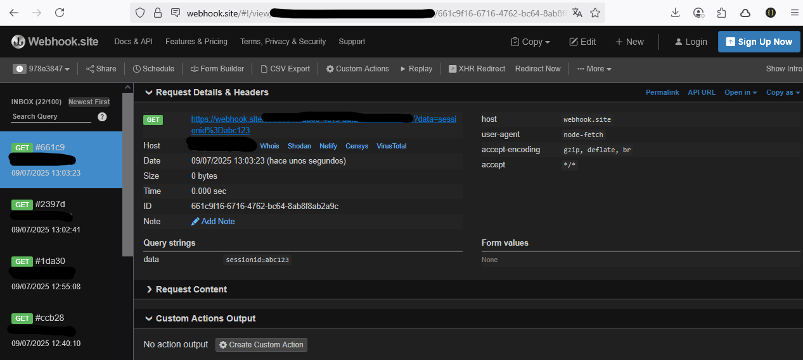

# Malicious JS Injection Lab

Este laboratorio demuestra cómo se puede inyectar código malicioso dentro de un archivo JavaScript legítimo para robar información sensible.

## 📂 Estructura básica
- index.html — Página de prueba.
- scrollToSection.js — Script con payload malicioso.
- server.js — Servidor Express que actúa como proxy seguro.
- .env — Contiene tu URL secreta del Webhook.
- package.json — Dependencias y scripts.

## 📄 Configuración del `.env`

Para usar este laboratorio, necesitas definir la URL de tu Webhook de prueba como variable de entorno.  
Crea un archivo llamado `.env` en la raíz del proyecto con este contenido:

```env
WEBHOOK_URL=https://webhook.site/TU-UUID-AQUI
```

## 🔥 Cómo funciona

1. Ejecuta el servidor local:
    - npm install
    - npm start
2. Abre `http://localhost:3000` en tu navegador. 
Abre la consola del navegador e ingresa la siguiente cookie: 

     ```document.cookie = "sessionid=abc123; path=/";``` 

    Esto creará una cookie llamada sessionid con valor abc123 para tu servidor local.

3.  Recarga la página y zaz clic en el botón: se hará una solicitud fetch al proxy backend, que enviará la información robada a tu Webhook.
4. En [Webhook.site](https://webhook.site) verás la cookie capturada.

## 🚩 Qué se demuestra

- Inyección oculta dentro de scripts legítimos.
- Robo de `document.cookie`.
- Ejecución automática del payload malicioso.

    ### Ejemplo: 

    

## 🔒 Contramedidas recomendadas

✅ Usar Subresource Integrity (SRI) para validar recursos.  
✅ Revisar hashes de archivos servidos  
✅ Usar CI/CD seguro  
✅ Controlar dependencias externas

**¡Solo para uso educativo!**

### [Ver DeepWiki](https://deepwiki.com/Gonzalo-CR/Malicious_JS_Injection_Lab) 


